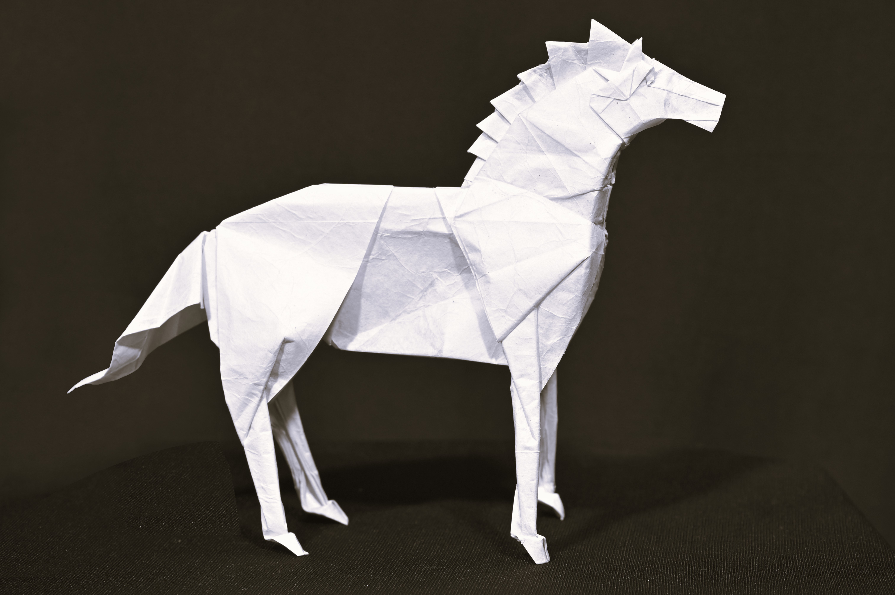
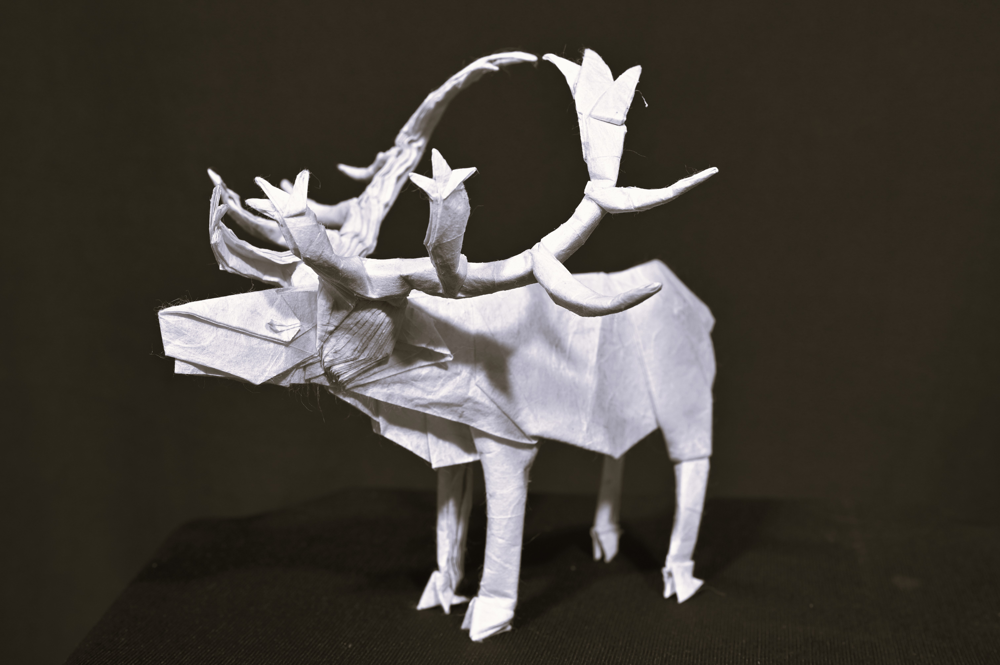

# Origami Collection

A personal collection of folded paper sculptures, created from single sheets without cuts or glue.

## Gallery

### Horse
**Designer:** Satoshi Kamiya

---

### Dragonfly
**Designer:** Shuki Kato

---

### Lion
**Designer:** Satoshi Kamiya

---

### Rooster
**Designer:** Satoshi Kamiya

---

### Caribou
**Designer:** Satoshi Kamiya

---

### Ancient Dragon
**Designer:** Satoshi Kamiya

---

### Great White Shark
**Designer:** Nguyen Ngoc Vu

---

### Hermit Crab
**Designer:** Satoshi Kamiya

---

### Grizzly Bear
**Designer:** Quentin Trollip

---

### Deer
**Designer:** Satoshi Kamiya

---

### Black Kite
**Designer:** Satoshi Kamiya

---

### Spinosaurus
**Designer:** Satoshi Kamiya

---

### Giganotosaurus
**Designer:** Shuki Kato

---

## About

Each model in this collection represents hours of careful folding and attention to detail. The designs are created by talented origami artists from around the world, including renowned folders like Satoshi Kamiya, Shuki Kato, Nguyen Ngoc Vu, and Quentin Trollip.

All photographs are original images of the completed models.
